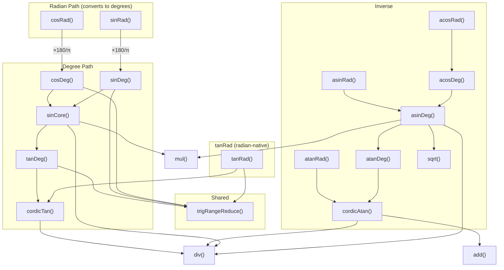

# Trigonometric Functions: Unified Analysis

This document provides a unified analysis of all 12 trigonometric entry points in the Proto BCD arithmetic reference implementation. It covers the mathematical foundations, implementation architecture, range reduction methods, CORDIC algorithm details, error handling, and measured precision characteristics.

**BCD context**: 16-digit mantissa, 2-digit exponent (range -99 to +99), HP-35 heritage CORDIC algorithm using atan(10^-j) constants.

**Related documents**:
- [tan-algorithm-research.md](tan-algorithm-research.md) - CORDIC algorithm comparison and selection rationale
- [tan-range-reduction-research.md](tan-range-reduction-research.md) - Range reduction design for tanDeg
- [tan10-algorithm-research.md](tan10-algorithm-research.md) - Degree-first design for tan/atan
- [sincos-algorithm-research.md](sincos-algorithm-research.md) - Half-angle formula for sin/cos and identity-based asin/acos
- [precision.md](precision.md) - Guard digit, sticky bit, and tolerance system

---

## 1. Mathematical Background

### 1.1 Tangent and Arctangent

**Tangent** (`tan(x)`): Maps an angle to the ratio of opposite/adjacent sides.
- Domain: all real numbers except asymptotes at 90 + 180k degrees (or pi/2 + k*pi radians)
- Range: (-inf, +inf)
- Period: 180 degrees (pi radians)
- Symmetry: odd function, tan(-x) = -tan(x)
- Asymptotes: at 90 + 180k degrees, result approaches +/-inf
- Special values: tan(0) = 0, tan(45) = 1, tan(30) = 1/sqrt(3), tan(60) = sqrt(3)

**Arctangent** (`atan(x)`): The inverse of tangent.
- Domain: all real numbers (no domain errors)
- Range: (-90, 90) degrees or (-pi/2, pi/2) radians
- Symmetry: odd function, atan(-x) = -atan(x)
- Special values: atan(0) = 0, atan(1) = 45 degrees, atan(inf) = 90 degrees
- Key identity: atan(x) = pi/2 - atan(1/x) for |x| > 1

### 1.2 Sine and Cosine

**Sine** (`sin(x)`): Maps an angle to the ratio of opposite/hypotenuse.
- Domain: all real numbers
- Range: [-1, 1]
- Period: 360 degrees (2*pi radians)
- Symmetry: odd function, sin(-x) = -sin(x)
- Key identity used: sin(x) = 2*tan(x/2) / (1 + tan^2(x/2))
- Special values: sin(0) = 0, sin(30) = 0.5, sin(45) = sqrt(2)/2, sin(60) = sqrt(3)/2, sin(90) = 1

**Cosine** (`cos(x)`): Maps an angle to the ratio of adjacent/hypotenuse.
- Domain: all real numbers
- Range: [-1, 1]
- Period: 360 degrees (2*pi radians)
- Symmetry: even function, cos(-x) = cos(x)
- Key identity used: cos(x) = sin(x + 90)
- Special values: cos(0) = 1, cos(60) = 0.5, cos(90) = 0, cos(180) = -1

### 1.3 Arcsine and Arccosine

**Arcsine** (`asin(x)`): The inverse of sine.
- Domain: [-1, 1] (FLAG_INV_ERR for |x| > 1)
- Range: [-90, 90] degrees or [-pi/2, pi/2] radians
- Symmetry: odd function, asin(-x) = -asin(x)
- Key identity used: asin(x) = atan(1 / sqrt(1/x^2 - 1))
- Special values: asin(0) = 0, asin(0.5) = 30, asin(1) = 90

**Arccosine** (`acos(x)`): The inverse of cosine.
- Domain: [-1, 1] (FLAG_INV_ERR for |x| > 1)
- Range: [0, 180] degrees or [0, pi] radians
- Complementary identity: acos(x) = 90 - asin(x)
- Special values: acos(1) = 0, acos(0) = 90, acos(-1) = 180

### 1.4 Radians vs Degrees

The implementation uses a **degrees-first architecture**. Forward radian variants sinRad and cosRad convert the input to degrees (multiplying by 180/pi) and delegate to sinDeg and cosDeg respectively. This uses one irrational multiplication followed by exact decimal range reduction. tanRad and atanRad are independent: tanRad stays in radians with `trigRangeReduce(pi/4)`, and atanRad calls cordicAtan directly (CORDIC already returns radians). Inverse radian variants (asinRad, acosRad) call their degree counterpart and convert the output to radians.

This design has significant precision implications:
- **Degrees enable exact range reduction**: 360, 180, 90, and 45 are exact BCD constants. Modular reduction by these values introduces zero rounding error.
- **One irrational multiply for exact reduction**: sinRad/cosRad perform a single multiplication by 180/pi, then benefit from exact decimal range reduction in sinDeg/cosDeg. This eliminates irrational-constant cancellation that radian-native range reduction would suffer.
- **CORDIC works in radians internally**: After range reduction (whether from degrees or radians), the reduced angle is in radians for the CORDIC core. Degree functions convert their small reduced angle (0 to 45 degrees) to radians via pi/180; tanRad feeds the reduced angle directly.
- **Unified range reduction**: A single `trigRangeReduce(constId)` function handles both degree and radian paths, parameterized by the boundary constant (45, 90 for degrees; pi/4 for tanRad).

Conversion constants (full 16-digit BCD):
- pi/180 = 1.745329251994330e-2
- 180/pi = 5.729577951308232e+1
- pi/2 = 1.570796326794897e+0
- pi/4 = 7.853981633974483e-1

---

## 2. Implementation Architecture

### 2.1 Function Entry Points

All 12 trigonometric entry points, their source files, input/output units, and core algorithm:

| Function | File | Input | Output | Algorithm | Calls |
|----------|------|-------|--------|-----------|-------|
| `tanDeg` | `tan10.cpp` | degrees | value | Unified range reduce + CORDIC | `trigRangeReduce`, `cordicTan` |
| `tanRad` | `tan.cpp` | radians | value | Unified range reduction + direct CORDIC | `trigRangeReduce`, `cordicTan` |
| `atanDeg` | `tan10.cpp` | value | degrees | CORDIC + convert to deg | `cordicAtan` |
| `atanRad` | `tan.cpp` | value | radians | CORDIC (direct) | `cordicAtan` |
| `sinDeg` | `sin.cpp` | degrees | value | Half-angle + CORDIC | `trigRangeReduce`, `sinCore`, `tanDeg` |
| `sinRad` | `sin.cpp` | radians | value | Converts to degrees, delegates to sinDeg | `sinDeg` |
| `cosDeg` | `cos.cpp` | degrees | value | Quadrant-shifted range reduction + sinCore | `trigRangeReduce`, `sinCore` |
| `cosRad` | `cos.cpp` | radians | value | Converts to degrees, delegates to cosDeg | `cosDeg` |
| `asinDeg` | `asin.cpp` | value | degrees | Identity via atan | `atanDeg`, `sqrt`, `div`, `mul` |
| `asinRad` | `asin.cpp` | value | radians | asinDeg + convert | `asinDeg` |
| `acosDeg` | `acos.cpp` | value | degrees | Complement of asin | `asinDeg` |
| `acosRad` | `acos.cpp` | value | radians | acosDeg + convert | `acosDeg` |

### 2.2 Dependency Graph



All paths ultimately converge on `cordicTan` or `cordicAtan` as the shared computational engines. These two functions are the only ones that perform the CORDIC digit-by-digit rotation using the atan constant table. sinRad and cosRad convert to degrees and merge into the degree path. tanRad stays radian-native with its own `trigRangeReduce(pi/4)` call. cosDeg calls `trigRangeReduce` and `sinCore` directly (not sinDeg).

---

## 3. Range Reduction Methods

### 3.1 Unified Range Reduction: trigRangeReduce(constId)

`trigRangeReduce(S0, S1)` is parameterized by boundary constant loaded into S1 by the caller. For tanDeg the boundary is CONST_45 (45 degrees); for sinDeg and cosDeg it is CONST_90 (90 degrees); for tanRad it is CONST_PI_OVER_4 (pi/4). sinRad and cosRad convert to degrees and delegate to sinDeg/cosDeg, so `trigRangeReduce` is not called with pi/2 boundary.

The reduction converts any angle to [0, boundary] using four steps:

| Step | Identity | Reduction | Method |
|------|----------|-----------|--------|
| 1 | f(x) = f(x mod 4*boundary) | [0, 4*boundary) | O(1): `x - floor(x/(4*boundary)) * (4*boundary)` |
| 2 | f(x) = f(x - 2*boundary) | [0, 2*boundary) | Subtract 2*boundary if >= 2*boundary |
| 3 | f(x) = -f(2*boundary - x) | [0, boundary) | Reflect at boundary, set negate flag |
| 4 | f(x) = 1/f(boundary - x) | [0, boundary] | Reflect at boundary/2, set reciprocal flag |

For degree boundaries (45, 90, 180, 360), all constants are exact BCD values, so reduction is lossless. For radian boundaries (pi/4, pi/2, pi, 2*pi), the irrational constants introduce ~0.5 ULP per reduction step.

The `truncate()` function returns void and sets `g_negateResult` (from bit 1) and `g_useReciprocal` (from bit 0) of the integer mod 4 as global side effects.

After reduction, degree functions convert the small reduced angle to radians (multiplying by pi/180) for the CORDIC core. Radian functions feed the reduced angle directly to cordicTan — no conversion needed.

**Post-processing flags** (for tan): `doReciprocal = g_negateResult XOR g_useReciprocal`.

**Asymptote detection**: If the reduced angle has a zero mantissa and `doReciprocal` is true, the original angle was at an asymptote (90 + 180*k degrees, or pi/2 + k*pi radians). This sets FLAG_OF_ERR. With `TAN_HANDLE_LARGE_X=0` (the active default), only exact-zero mantissa is checked. The disabled `TAN_HANDLE_LARGE_X=1` path would additionally handle near-zero angles (exponent <= -13) by computing the reciprocal directly.

### 3.2 sinDeg/sinRad: trigRangeReduce with 90° Boundary

sinDeg uses `trigRangeReduce(CONST_90)`. sinRad converts to degrees and delegates to sinDeg, so it also uses the 90-degree boundary indirectly.

The `truncate()` function returns void and sets `g_negateResult` (bit 1) and `g_useReciprocal` (bit 0) from the integer mod 4 as global side effects. For sine, `g_useReciprocal` is ignored — sine does not need the reciprocal reduction that tangent uses.

After reduction to (0, 90] degrees, the half-angle formula uses `tan(x/2)` where x/2 is in (0, 45] degrees. This keeps the tangent argument in [0, 1], the optimal range for CORDIC convergence.

### 3.3 atan: How cordicAtan Handles All Magnitudes

`cordicAtan` does NOT use reciprocal reduction. The CORDIC vectoring mode handles |x| > 1 directly: counter[0] can reach up to 9 (since BCD digits go 0-9), allowing the initial rotation to consume inputs as large as ~9. For values between 1 and ~9, the CORDIC iterations naturally decompose the angle without any explicit reciprocal step.

For larger inputs, the CORDIC rotation at position j=0 would need a counter > 9, which is not possible in BCD. However, cordicAtan handles this through two mechanisms:

1. **Large-value shortcut**: For |x| >= 10^15, the difference between atan(x) and pi/2 is less than 10^-15, below the 16-digit precision floor. The function returns pi/2 (or 90 degrees) directly without computing CORDIC.

2. **Small-angle Taylor bypass** (`SMALL_ATAN_TAYLOR=1`): For |x| < 0.001, the Taylor series bypass avoids `normalizeToZeroExp` digit loss.

### 3.4 Unit Conversions

sinRad and cosRad convert input radians to degrees and delegate. tanRad stays in radians. Degree functions convert the small reduced angle to radians for the CORDIC core. Inverse radian variants convert degree output to radians:

| Function | Conversion | Constant | Notes |
|----------|-----------|----------|-------|
| `tanDeg` | reduced deg → rad (for CORDIC) | CONST_PI_OVER_180 | Small angle only (0-45°) |
| `tanRad` | (none) | — | Stays in radians throughout |
| `sinDeg` | (via tanDeg) | CONST_PI_OVER_180 | Inherited from tanDeg |
| `sinRad` | rad → deg input (×180/π) | CONST_180_OVER_PI | Delegates to sinDeg |
| `cosDeg` | (none — quadrant shift, no conversion) | — | trigRangeReduce(90) + sinCore (inherits tanDeg's conversion) |
| `cosRad` | rad → deg input (×180/π) | CONST_180_OVER_PI | Delegates to cosDeg |
| `asinRad` | result: `rad = deg * pi/180` | CONST_PI_OVER_180 | Degree output → radian |
| `acosRad` | result: `rad = deg * pi/180` | CONST_PI_OVER_180 | Degree output → radian |

**tanRad asymptote handling**: tanRad performs its own range reduction via `trigRangeReduce(CONST_PI_OVER_4)` and checks for zero mantissa with `doReciprocal` set. With `TAN_HANDLE_LARGE_X=0` (current default), only exact-zero mantissa triggers FLAG_OF_ERR.

---

## 4. CORDIC Algorithm

### 4.1 Overview

The implementation uses Meggitt's pseudo-division/pseudo-multiplication method, the same approach used in the HP-35 calculator. CORDIC operates entirely with BCD digit-level shifts and additions, requiring no multiplication in the inner loop.

Two functions share the same atan constant table:
- `cordicTan` (tan.cpp): Computes tan(angle) from a small radian angle
- `cordicAtan` (tan.cpp): Computes atan(value) returning radians

### 4.2 The Atan Constant Table

Eight precomputed constants stored as 16-digit BCD mantissas:

| Index j | Constant | Value (16 digits) |
|---------|----------|-------------------|
| 0 | atan(1) | 0.7853981633974483 |
| 1 | atan(0.1) | 0.0996686524911620 |
| 2 | atan(0.01) | 0.0099996666866665 |
| 3 | atan(0.001) | 0.0009999996666668 |
| 4 | atan(0.0001) | 0.0000999999966666 |
| 5 | atan(0.00001) | 0.0000099999999966 |
| 6 | atan(1e-6) | 0.0000009999999999 |
| 7 | atan(1e-7) | 0.0000000999999999 |

For j >= 8, constants are generated dynamically: atan(10^-j) approximates 10^-j for small values, which is simply (j+1) leading zeros followed by 9s. This approximation is exact to 16 digits for j >= 8 because the Taylor remainder atan(x) - x = -x^3/3 + ... is negligible at 10^-8 and below.

### 4.3 cordicTan: Angle to Tangent

Computes `tan(angle)` where `angle` is a small positive radian value (at most ~0.785 radians after range reduction).

**Part 1 - Pseudo-division (digit extraction)**: For each position j = 0..K-1 (K=8), count how many times atan(10^-j) can be subtracted from the remaining angle. The count for each position (0-9) forms a digit in the BCD decomposition of the angle.

```
angle = sum over j of count[j] * atan(10^-j)  +  remainder
```

**Part 2 - Pseudo-multiplication (CORDIC rotation)**: Starting with vector (x=1, y=remainder), rotate by the extracted counts. For each j from K-1 down to 0, for each count:
```
y_new = y + x >> j
x_new = x - y >> j
```

Where `>> j` means shifting the mantissa right by j digit positions (dividing by 10^j).

**Part 3 - Result**: The tangent is y/x. Both y and x are normalized to proper BCD numbers and divided using the standard `div()` function.

**Overflow**: If x reaches zero during rotation, the tangent is infinity (FLAG_OF_ERR).

### 4.4 cordicAtan: Value to Arctangent

Computes `atan(value)` returning the result in radians.

**Setup**: Initialize vector (x=1, y=value) with mantissa alignment via `normalizeToZeroExp`. For negative exponents (|value| < 1), shift y mantissa right; the exponent is zeroed.

**Part 1 - CORDIC vectoring (pseudo-division)**: Rotate the vector (x, y) toward the x-axis. For each position j = 0..K-1 (K=8), while y - (x >> j) >= 0:
```
y_new = y - x_shifted
x_new = x + y_shifted   (note: y_shifted computed BEFORE y update)
count[j]++
```

This counts how many atan(10^-j) rotations are needed to reduce y toward zero.

**Part 2 - Residual**: Divide remaining y by x using `div()` to get the small residual angle.

**Part 3 - Accumulate**: The result is the residual plus the sum of count[j] * atan_const[j] for j = K-1 down to 0. Each atan constant is added count[j] times using the standard `add()` function.

### 4.5 Register Usage

| Register | cordicTan | cordicAtan |
|----------|-----------|------------|
| S0 | Input angle, then y | Input value (y) |
| S1 | Working mantissa, then x | x = 1.0 |
| S2 | Digit counters (mant[0..7]) | Digit counters (mant[0..7]) |
| S3 | Save y (during rotation) | Save y (during vectoring) |
| S4 | Save x (during rotation) | Save x (during vectoring) |
| R | Rotation temp, then result | Shifted values, then result |

Note: `mul()` uses S2 as its internal accumulator. Functions that call `mul()` (like `sinCore`) can only rely on S3 and S4 being preserved across mul calls.

---

## 5. Error Handling

### 5.1 Error Flags

Three error flags declared in `proto.h:27-31`:

| Flag | Printed As | Meaning |
|------|-----------|---------|
| `FLAG_INV_ERR` | INVALID | Input is outside the function's domain |
| `FLAG_OF_ERR` | OVERFLOW | Result exceeds +/-9.999999999999999e+99 |
| `FLAG_DIV0_ERR` | DIV0 | Division by zero |

### 5.2 Per-Function Error Conditions

| Function | Possible Error | Condition | Detection |
|----------|---------------|-----------|-----------|
| tanDeg | OVERFLOW | Asymptote at 90 + 180k deg | Reduced angle = 0 with reciprocal flag |
| tanRad | OVERFLOW | Asymptote at pi/2 + k*pi | Own near-zero check after trigRangeReduce(π/4) |
| atanDeg | (none) | Full domain | N/A |
| atanRad | (none) | Full domain | N/A |
| sinDeg | (none) | Full domain | N/A |
| sinRad | (none) | Full domain | N/A |
| cosDeg | (none) | Full domain | N/A |
| cosRad | (none) | Full domain | N/A |
| asinDeg | INVALID | \|x\| > 1 | `isRegGT(S0, CONST_1)` |
| asinRad | INVALID | \|x\| > 1 | Propagated from asinDeg |
| acosDeg | INVALID | \|x\| > 1 | `isRegGT(S0, CONST_1)` |
| acosRad | INVALID | \|x\| > 1 | Propagated from acosDeg |

### 5.3 Asymptote Detection Details

**tanDeg**: Asymptotes are detected after `trigRangeReduce(CONST_45)` reduces to [0, 45]. If the reduced angle has a zero mantissa and `doReciprocal` is true, the original angle was at an exact asymptote (90 + 180k degrees). The function sets FLAG_OF_ERR and returns. With `TAN_HANDLE_LARGE_X=0` (current default), only exact-zero mantissa is checked; the disabled path (`TAN_HANDLE_LARGE_X=1`) would additionally compute cot(epsilon) directly for near-zero angles (exponent <= -13).

**tanRad**: tanRad has its own asymptote detection after `trigRangeReduce(CONST_PI_OVER_4)`. The same zero-mantissa check applies: if the reduced angle has a zero mantissa and `doReciprocal` is true, the original angle was at an asymptote (pi/2 + k*pi radians). The disabled `TAN_HANDLE_LARGE_X=1` path would handle the near-zero case where the irrational pi/4 boundary introduces rounding error, producing a tiny nonzero residual instead of exact zero.

### 5.4 IEEE Validation of BCD Errors

The test framework (`testbench.inl:145-171`) validates that BCD error flags are consistent with IEEE results:

| BCD Error | IEEE Must Be |
|-----------|-------------|
| INVALID | `isnan(ieee)` or `isinf(ieee)` |
| OVERFLOW | `isinf(ieee)` or `fabs(ieee) > 1e13` |
| DIV0 | `isinf(ieee)` or `isnan(ieee)` |

The `|ieee| > 1e13` relaxation for OVERFLOW handles cases like `tan(pi/2)` where IEEE produces a very large finite value due to pi/2 being only approximate in binary floating-point.

---

## 6. Precision Analysis

### 6.1 Operation Chain Analysis

Each trigonometric function builds on lower-level operations, each contributing error. The theoretical precision budget for each function:

| Function | Operation Chain | Error Sources | Expected Digits |
|----------|----------------|---------------|-----------------|
| tanDeg | range reduce (exact) + rad convert (1 mul) + CORDIC (~14.8 digits) + optional reciprocal (1 div) | mul: ~0.5 ULP, CORDIC: ~1-2 digits, div: ~0.5 ULP | ~14 |
| tanRad | range reduce (irrational boundary) + CORDIC + optional reciprocal | Boundary: ~0.5 ULP, CORDIC: ~1-2 digits, div: ~0.5 ULP | ~14.5 |
| atanDeg | cordicAtan + deg convert (1 mul) | CORDIC: ~1-2 digits, mul: ~0.5 ULP | ~14 |
| atanRad | cordicAtan (direct) | CORDIC: ~1-2 digits | ~14.5 |
| sinDeg | range reduce (exact) + div by 2 + tanDeg + 2 mul + add + div | 6 operations | ~13.5 |
| sinRad | rad→deg conversion (1 mul) + sinDeg chain | Conversion: ~0.5 ULP, then sinDeg chain | ~13.5 |
| cosDeg | trigRangeReduce(90) + quadrant shift + sub + sinCore (half-angle) | Same ops as sinDeg (quadrant shift is exact) | ~13.5 |
| cosRad | rad→deg conversion (1 mul) + cosDeg chain | Conversion: ~0.5 ULP, then cosDeg chain | ~13.5 |
| asinDeg | mul + div + sub + sqrt + reciprocal + atanDeg | 6 operations | ~13 |
| asinRad | asinDeg + deg-to-rad (1 mul) | Extra mul: ~0.5 ULP | ~12.5 |
| acosDeg | asinDeg + sub | Trivial overhead | ~13 |
| acosRad | acosDeg + deg-to-rad (1 mul) | Extra mul: ~0.5 ULP | ~12.5 |

### 6.2 Measured Test Results

Test results from running each function with fixed test vectors, round-trip tests, and 500 random samples.

**Tolerance thresholds (Relaxed class)**: PASS = relative error <= 1e-13 (13+ digits), NEAR = <= 1e-12 (12-13 digits), MISS = > 1e-12.

#### Fixed Test Vectors

| Function | Tests | PASS | NEAR | MISS | Notes |
|----------|------:|---:|-------:|-----:|-------|
| tanDeg | 57 | 57 | 37 | 10 | Near-asymptote cases MISS |
| tanRad | 47 | 47 | 17 | 23 | Large-angle + small-angle cases |
| atanDeg | 24 | 24 | 0 | 0 | Full domain coverage |
| atanRad | 20 | 20 | 0 | 0 | Full domain coverage |
| sinDeg | 96 | 96 | 0 | 0 | Half-angle chain, all PASS |
| sinRad | 39 | 39 | 8 | 0 | Degree conversion path |
| cosDeg | 92 | 92 | 1 | 0 | Quadrant-shifted range reduction |
| cosRad | 41 | 41 | 14 | 1 | Degree conversion path |
| asinDeg | 23 | 23 | 4 | 0 | Near-boundary cases NEAR |
| asinRad | 13 | 13 | 2 | 0 | Minimal overhead from conversion |
| acosDeg | 26 | 26 | 0 | 1 | Near x=1 boundary case |
| acosRad | 14 | 14 | 0 | 0 | Best inverse trig precision |

#### Random Tests (500 samples each)

| Function | PASS | NEAR | MISS | Notes |
|----------|---:|-------:|-----:|-------|
| tanDeg | 403 | 86 | 11 | ±999° range |
| tanRad | 374 | 119 | 7 | ±99 rad range |
| atanDeg | 499 | 1 | 0 | Full domain |
| atanRad | 499 | 0 | 1 | Full domain |
| sinDeg | 388 | 105 | 7 | Half-angle chain |
| sinRad | 433 | 62 | 5 | Degree conversion path |
| cosDeg | 473 | 27 | 0 | Quadrant-shifted range reduction |
| cosRad | 432 | 63 | 5 | Degree conversion path |
| asinDeg | 372 | 126 | 2 | OPTS_ASINCOS keeps all samples in domain |
| asinRad | 375 | 125 | 0 | Minimal overhead |
| acosDeg | 500 | 0 | 0 | Excellent precision across domain |
| acosRad | 500 | 0 | 0 | Near-perfect results |

Note: tanDeg random range is ±999° (~2.8 circles). tanRad random range is ±99 rad (~15.8 rotations). asin/acos use OPTS_ASINCOS which generates values in [0.01, 1) with random sign, keeping all samples within the valid domain.

#### Round-Trip Tests

Round-trip tests verify `forward(inverse(x)) = x` (e.g., `tan(atan(x))`):

| Round-Trip | Fixed | Random (500) | Notes |
|-----------|-------|---------------|-------|
| tan(atan(x)) deg | 22P, 4N, 2M | 459P, 6N, 35M | Fixed values include large angles |
| tan(atan(x)) rad | 22P, 4N, 2M | 454P, 9N, 37M | Large-angle round trips degrade |
| exp(ln(x)) | 4P, 8N, 1M | 249P, 63N, 188M | Large values lose precision |
| sin(asin(x)) deg | 25P, 2N, 0M | N/A | Domain limits random testing |
| sin(asin(x)) rad | 13P, 2N, 0M | N/A | |
| cos(acos(x)) deg | 22P, 4N, 1M | N/A | |
| cos(acos(x)) rad | 12P, 2N, 0M | N/A | |

### 6.3 Precision by Input Range

Error clustering patterns observed across test results:

**tanDeg/tanRad - Near asymptotes**: Near 90 degrees (or pi/2 radians), tiny angle changes produce huge result changes. At 89.9 degrees, err ~ 1.6e-8 (only ~8 correct digits) because the result itself (~573) magnifies any input error. These errors only affect direct tanDeg/tanRad calls. Functions that use tanDeg internally (sinDeg, cosDeg, sinRad, cosRad) are **not** affected: sinDeg range-reduces to (0, 90] and then calls `tan(angle/2)` where angle/2 is in (0, 45], keeping the tangent argument in [0, 1] — well away from any asymptote. sinRad and cosRad convert to degrees and delegate to sinDeg/cosDeg, so they inherit the same safe behavior. asinDeg/acosDeg call atanDeg, not tanDeg, so asymptote errors do not propagate to them either.

**tanDeg - Small angles**: For angles < 1 degree, the degrees-to-radians conversion introduces multiplicative error. tan(0.001 deg) shows err ~ 4.2e-14 (MISS), a systematic ~14.3-digit precision from the pi/180 constant's limited accuracy.

**sinDeg/sinRad - Consistent ~13.5 digits**: The half-angle formula chains 6 operations (div, tan, 2 mul, add, div), each contributing ~0.5 ULP. Random tests show ~1.4% MISS rate for sinDeg at the Relaxed threshold, consistent with the operation chain budget of ~13.5 digits. sinRad converts to degrees and delegates to sinDeg, adding one irrational multiplication (×180/pi) followed by exact decimal range reduction. Random tests show ~1% MISS rate for sinRad. The errors come from operation chain accumulation, not from tan near-asymptote issues (see note above).

**atanDeg/atanRad - Small input degradation**: For |x| < 1e-6, the CORDIC vectoring produces fewer significant digits in the count array. At 1e-14, the result has only ~13 correct digits because most CORDIC iterations produce zero counts.

**asinDeg - Near boundaries**: At x = 0.999999999999999 (near +1), the intermediate 1/x^2 - 1 computation involves catastrophic cancellation (subtracting nearly equal numbers), yielding err ~ 1.78e-11 (only ~11 correct digits). This is inherent to the identity-based approach.

### 6.4 Error Source Breakdown

| Error Source | Magnitude | Affected Functions |
|-------------|-----------|-------------------|
| CORDIC core (K=8 stored constants + residual division) | ~1-2 digits lost | All (via cordicTan/cordicAtan) |
| pi/180 constant precision | ~0.5 ULP per conversion | Degree functions (tanDeg→CORDIC), inverse radian variants (asinRad, acosRad) |
| mul/div operations | ~0.5 ULP each | sinDeg (6 ops), sinRad (6 ops), asinDeg (6 ops) |
| Half-angle formula chain | ~2-3 ULP accumulated | sinDeg, cosDeg, sinRad, cosRad |
| Catastrophic cancellation | Up to 5+ digits | asinDeg near |x|=1 |
| Range reduction (degrees) | 0 (exact) | tanDeg, sinDeg |
| Range reduction (radians) | ~0.5 ULP (irrational boundary) | tanRad |
| Rad→deg conversion | ~0.5 ULP (×180/π) | sinRad, cosRad |

### 6.5 Summary Table

| Function | Typical Digits | Worst Case | Worst Input Region |
|----------|:-:|:-:|-------------------|
| tanDeg | 13-14 | ~8 | Near asymptotes (89.9+) |
| tanRad | 14-15 | ~8 | Near pi/2 |
| atanDeg | 14-15 | ~13 | Very small inputs |
| atanRad | 14-15 | ~13 | Very small inputs |
| sinDeg | 13-14 | ~13 | Consistent across range |
| sinRad | 13-14 | ~13 | Consistent across range |
| cosDeg | 14 | ~13 | Near cos = 0 |
| cosRad | 13-14 | ~13 | Near cos = 0 |
| asinDeg | 13-14 | ~11 | Near |x| = 1 |
| asinRad | 13-14 | ~11 | Near |x| = 1 |
| acosDeg | 13-14 | ~11 | Near |x| = 1 |
| acosRad | 13-14 | ~11 | Near |x| = 1 |

Note: "Worst Case" for tanDeg/tanRad reflects behavior near asymptotes where the mathematical function itself amplifies any input error. Away from asymptotes, tanDeg consistently delivers 13+ correct digits. tanRad stays in radians with trigRangeReduce(pi/4), improving typical precision from 13-14 to 14-15 digits by eliminating the rad-to-deg conversion. For asin/acos, the worst case near |x| = 1 is due to catastrophic cancellation in the intermediate computation (see Section 6.3).

---

## 7. Constants

### 7.1 Simple Constants (const.cpp:18-25)

Stored as {mant[0], mant[1], exp[1]} with exp[0] = 0 and remaining mantissa digits = 0:

| Constant | ID | Value | Mantissa | Exponent |
|----------|:--:|------:|:--------:|:--------:|
| CONST_1 | 0 | 1 | 1.0 | e+0 |
| CONST_2 | 1 | 2 | 2.0 | e+0 |
| CONST_45 | 2 | 45 | 4.5 | e+1 |
| CONST_90 | 3 | 90 | 9.0 | e+1 |
| CONST_180 | 4 | 180 | 1.8 | e+2 |
| CONST_360 | 5 | 360 | 3.6 | e+2 |

These are all exact in BCD representation. Range reduction using these constants introduces zero rounding error.

### 7.2 Transcendental Constants (const.cpp:30-47)

Full 16-digit BCD mantissa values:

| Constant | ID | Full Mantissa | Exponent | True Value |
|----------|:--:|:-------------|:--------:|------------|
| CONST_PI_OVER_180 | 6 | 1,7,4,5,3,2,9,2,5,1,9,9,4,3,3,0 | e-2 | 0.01745329251994330... |
| CONST_180_OVER_PI | 7 | 5,7,2,9,5,7,7,9,5,1,3,0,8,2,3,2 | e+1 | 57.29577951308232... |
| CONST_PI_OVER_2 | 8 | 1,5,7,0,7,9,6,3,2,6,7,9,4,8,9,7 | e+0 | 1.570796326794897... |
| CONST_LN10 | 9 | 2,3,0,2,5,8,5,0,9,2,9,9,4,0,4,6 | e+0 | 2.302585092994046... |
| CONST_PI_OVER_4 | 10 | 7,8,5,3,9,8,1,6,3,3,9,7,4,4,8,3 | e-1 | 0.7853981633974483... |

These constants are stored as 16 significant digits (some rounded, some truncated as noted below). The 17th digit and beyond are lost, contributing ~0.5 ULP of systematic error per multiplication.

Verification against exact values:
- pi/180 = 0.01745329251994329576923690768489... (stored as ...4330, rounded)
- 180/pi = 57.29577951308232087679815481410... (stored as ...8232, truncated)
- pi/2 = 1.57079632679489661923132169164... (stored as ...4897, rounded)
- pi/4 = 0.78539816339744830961566084581988... (stored as ...4483, truncated)

### 7.3 CORDIC Atan Constants (tan.cpp:27-36)

Eight stored constants plus dynamic generation for j >= 8:

| j | Stored Mantissa | Actual Value |
|:-:|:---------------|:------------|
| 0 | 0,7,8,5,3,9,8,1,6,3,3,9,7,4,4,8 | atan(1) = 0.78539816339744830... |
| 1 | 0,0,9,9,6,6,8,6,5,2,4,9,1,1,6,2 | atan(0.1) = 0.09966865249116202... |
| 2 | 0,0,0,9,9,9,9,6,6,6,6,8,6,6,6,5 | atan(0.01) = 0.00999966668666652... |
| 3 | 0,0,0,0,9,9,9,9,9,9,6,6,6,6,6,8 | atan(0.001) = 0.00099999966666687... |
| 4 | 0,0,0,0,0,9,9,9,9,9,9,9,9,6,6,6 | atan(0.0001) = 0.00009999999966667... |
| 5 | 0,0,0,0,0,0,9,9,9,9,9,9,9,9,9,9 | atan(1e-5) = 0.00000999999999667... |
| 6 | 0,0,0,0,0,0,0,9,9,9,9,9,9,9,9,9 | atan(1e-6) = 0.00000099999999999... |
| 7 | 0,0,0,0,0,0,0,0,9,9,9,9,9,9,9,9 | atan(1e-7) = 0.00000009999999999... |
| 8+ | Generated: (j+1) zeros then 9s | atan(10^-j) ~ 10^-j |

For j >= 8, atan(10^-j) = 10^-j - 10^(-3j)/3 + ..., and the correction term 10^(-3j)/3 is less than 10^-24, far below 16-digit precision. The approximation atan(10^-j) = 10^-j is therefore exact for all stored digits.

---

## 8. Summary

### 8.1 Quick Reference

| Function | File | Algorithm | Precision | Dependencies |
|----------|------|-----------|:---------:|-------------|
| tanDeg | tan10.cpp | Range reduce + CORDIC | ~14 digits | trigRangeReduce, cordicTan |
| tanRad | tan.cpp | Unified range reduce + direct CORDIC | ~14.5 digits | trigRangeReduce, cordicTan |
| atanDeg | tan10.cpp | CORDIC + convert | ~14 digits | cordicAtan |
| atanRad | tan.cpp | CORDIC direct | ~14.5 digits | cordicAtan |
| sinDeg | sin.cpp | Half-angle + CORDIC | ~13.5 digits | trigRangeReduce, tanDeg |
| sinRad | sin.cpp | Converts to degrees, delegates to sinDeg | ~13.5 digits | sinDeg |
| cosDeg | cos.cpp | Quadrant-shifted range reduction + sinCore | ~13.5 digits | trigRangeReduce, sinCore |
| cosRad | cos.cpp | Converts to degrees, delegates to cosDeg | ~13.5 digits | cosDeg |
| asinDeg | asin.cpp | atan(1/sqrt(1/x^2-1)) | ~13 digits | atanDeg, sqrt |
| asinRad | asin.cpp | asinDeg + convert | ~12.5 digits | asinDeg |
| acosDeg | acos.cpp | 90 - asinDeg | ~13 digits | asinDeg |
| acosRad | acos.cpp | acosDeg + convert | ~12.5 digits | acosDeg |

### 8.2 Design Rationale

**Why degrees-first**: Exact decimal range reduction (360, 180, 90, 45 are all exact BCD constants). Radian range reduction requires dividing by pi, which is irrational and introduces error at the very first step.

**Why half-angle for sine**: The identity sin(x) = 2t/(1+t^2) reuses the existing tanDeg CORDIC pipeline. Alternative approaches (separate CORDIC for sin/cos, Taylor series) would require additional constant tables or more complex iteration loops with no significant precision advantage.

**Why quadrant-shifted range reduction for cosine**: cosDeg uses `trigRangeReduce(CONST_90)` followed by incrementing the 2-bit quadrant counter `{g_negateResult, g_useReciprocal}` by 1. This achieves `cos(x) = sin(x + 90)` without adding 90 to the input angle. After the quadrant shift, the complement operation `90 - reduced_angle` is computed on a small value (the reduced angle is in [0, 90)), so it is always exact in decimal. This avoids the precision loss of adding 90 to a large input and avoids redundant range reduction (sinDeg would range-reduce again). cosDeg then calls sinCore directly. cosRad converts to degrees and delegates to cosDeg, gaining the same exact-decimal advantages.

**Why identity-based asin/acos**: The formula asin(x) = atan(1/sqrt(1/x^2 - 1)) reuses existing atan and sqrt functions. The restructured form avoids needing to preserve x across the sqrt call, which would be impossible given sqrt's use of all registers.

### 8.3 Known Limitations

1. **16-digit mantissa ceiling**: All functions are bounded by the BCD format's 16 significant digits. Even with perfect algorithms, cascading operations accumulate ~0.5 ULP per operation.

2. **Radian large-angle degradation**: For large radian inputs (|x| > 100), the range reduction via `trigRangeReduce` with irrational pi-based boundaries amplifies errors proportional to the input magnitude. The mod operation against irrational constants (pi/4, pi/2, 2*pi) introduces cancellation error similar to the old rad-to-deg conversion. Round-trip tests for tanRad at x ~ 1000 show errors in the 7th significant digit.

3. **Near-boundary precision for asin/acos**: The 1/x^2 - 1 computation in asinDeg involves catastrophic cancellation when |x| approaches 1. At x = 0.999999999999999, the intermediate subtraction loses nearly all significant digits. However, the subsequent sqrt and atan operations partially recover precision because atan compresses large values into a narrow range near 90 degrees. The final result still achieves ~11 correct digits (err ~ 1.78e-11), consistent with the measured data in Section 6.3.

4. **tanDeg MISS rate in random testing**: With the Relaxed tolerance class (tight=1e-13, loose=1e-12) and random angles up to ±999° (~2.8 circles), tanDeg's ~14.3-digit typical precision lands most results in the PASS or NEAR range. The remaining MISSes (~2.2%) come from near-asymptote cases where precision degrades below 12 digits. The algorithm consistently delivers 12-14 correct digits for angles away from 90 degrees/270 degrees.
